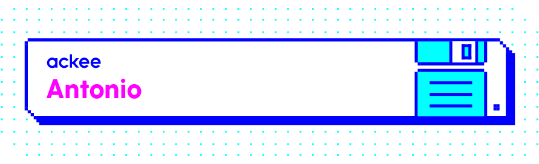
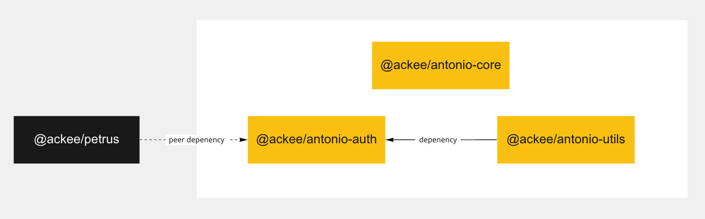

#  

# Antonio

HTTP client built on top of `fetch` API inspired by API design of [axios](https://github.com/axios/axios).

## Monorepo structure

-   [@ackee/antonio-core](packages/@ackee/antonio-core/README.md) - The HTTP client.
-   [@ackee/antonio-utils](packages/@ackee/antonio-utils/README.md) - Custom redux-saga effects for canceling request.
-   [@ackee/antonio-auth](packages/@ackee/antonio-auth/README.md) - A request interceptor which sets the `Authorization` header to access token obtained from [@ackee/petrus](https://github.com/AckeeCZ/petrus).

## Browsers support

It's compatible with all browsers in [`@ackee/browserslist-config`](https://github.com/AckeeCZ/browserslist-config).
